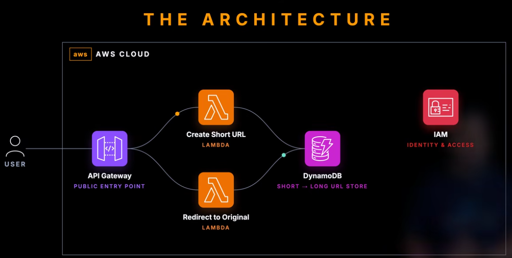

# URL Shortener

This project deploys a serverless request/response architecture for creating and resolving short URLs. API Gateway provides the public HTTP boundary, Lambda contains the application logic, and DynamoDB stores URL mappings without requiring servers or fixed database capacity.

## Architecture Diagram



## Architectural Approach

The application follows a compact serverless API pattern. API Gateway terminates client requests and routes each operation to a purpose-built Lambda function. DynamoDB acts as the durable key-value store for short IDs and long URLs, so the architecture can scale per request without managing compute hosts.

The create and redirect paths are intentionally separated into different Lambda functions and IAM roles. That keeps each function's permissions narrow: one path writes URL records, while the other only reads them.

## Request/Data Flow

1. `POST /create` stores a long URL in DynamoDB and returns a short ID.
2. `GET /{id}` reads the long URL and returns an HTTP redirect.
3. Only the create Lambda can call `dynamodb:PutItem`; only the redirect Lambda can call `dynamodb:GetItem`.

## Key AWS Services

- API Gateway exposes the REST endpoints, API key requirement, usage plan, throttling, and quota controls.
- Lambda runs the create and redirect handlers with separate CloudWatch log groups and least-privilege IAM roles.
- DynamoDB stores URL mappings in an encrypted table with point-in-time recovery.

## Operational Considerations

- This is a good fit for unpredictable or low-to-medium traffic because compute cost follows request volume.
- API keys and usage plans provide basic client control, but production systems should add stronger identity, abuse protection, and custom domain/TLS configuration.
- DynamoDB keeps the data layer simple, but table key design and TTL/cleanup policy would matter for a long-lived service.

## Remote State

The `backend/` folder bootstraps this project's Terraform state backend. It creates a private versioned S3 bucket for state, a DynamoDB table for state locking, and emits a `backend.hcl` file used by the main project. The bootstrap state stays local because the remote backend must exist before the main project can use it.

## Run

```bash
cp terraform.tfvars.example terraform.tfvars
terraform fmt -recursive

cd backend
terraform init
terraform apply
terraform output -raw backend_config > ../backend.hcl
cd ..

terraform init -backend-config=backend.hcl
terraform validate
terraform plan
terraform apply
```

Get the API key after apply:

```bash
terraform output -raw api_key_retrieval_command
```

Use the printed command, then call:

```bash
curl -X POST "$(terraform output -raw invoke_url)/create" \
  -H "x-api-key: API_KEY_HERE" \
  -H "content-type: application/json" \
  -d '{"url":"https://example.com"}'
```

## Tear Down

```bash
terraform destroy
cd backend
terraform destroy
```

Destroy the main lab before destroying `backend/`. Only destroy the backend after confirming you no longer need the state history stored in S3.

## Best Practices

- Do not commit `terraform.tfvars`, state files, generated plans, or API keys.
- Do not commit `backend.hcl`; it is generated from the bootstrap output.
- Keep API keys server-side for real applications.
- Use remote state with locking for team or production use.
- Review `terraform plan` before applying.
- Destroy lab resources when finished to avoid cost.
