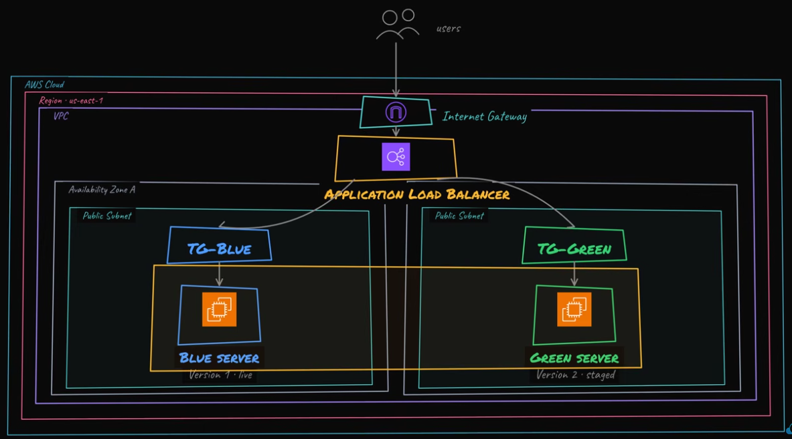

# Blue/Green Deployment

This project deploys a small blue/green EC2 architecture behind an Application Load Balancer. Traffic weights are controlled by Terraform through the `green_traffic_weight` variable.

## Architecture Diagram



## Architecture

- `modules/network` creates a VPC, two public subnets, an internet gateway, and public routing.
- `modules/security` creates separate ALB and EC2 security groups.
- `modules/compute` creates blue and green Amazon Linux 2023 EC2 instances with encrypted root volumes and SSM Session Manager permissions.
- `modules/load_balancer` creates the ALB, target groups, target attachments, and weighted listener rule.

Data flow:

1. Users access the ALB over HTTP.
2. The ALB forwards traffic to blue and green target groups based on `green_traffic_weight`.
3. EC2 instances accept HTTP only from the ALB security group.

## Remote State

The `backend/` folder bootstraps this project's Terraform state backend. It creates a private versioned S3 bucket for state, a DynamoDB table for state locking, and emits a `backend.hcl` file used by the main project. The bootstrap state stays local because the remote backend must exist before the main project can use it.

## Run

```bash
cp terraform.tfvars.example terraform.tfvars
terraform fmt -recursive

cd backend
terraform init
terraform apply
terraform output -raw backend_config > ../backend.hcl
cd ..

terraform init -backend-config=backend.hcl
terraform validate
terraform plan
terraform apply
```

Change traffic split by editing:

```hcl
green_traffic_weight = 50
```

Then run:

```bash
terraform plan
terraform apply
```

Open the app:

```bash
terraform output -raw alb_url
```

## Tear Down

```bash
terraform destroy
cd backend
terraform destroy
```

Destroy the main lab before destroying `backend/`. Only destroy the backend after confirming you no longer need the state history stored in S3.

## Best Practices

- Do not open SSH to the internet; use SSM Session Manager if instance access is needed.
- Keep ALB and instance security groups separate.
- Use small traffic increments for real blue/green rollouts.
- Do not commit local state, `.tfvars`, generated plans, or `backend.hcl`.
- Destroy the lab when finished to avoid EC2 and ALB costs.
