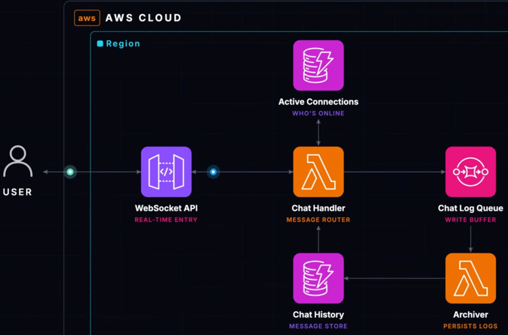

# Chat Application

This project deploys a serverless real-time chat backend with an event-driven archive path. API Gateway WebSocket APIs handle persistent client connections, Lambda processes connection and message events, DynamoDB tracks state, and SQS decouples message delivery from history persistence.

## Architecture Diagram



## Architectural Approach

The architecture combines synchronous WebSocket handling with asynchronous message archiving. Connection, disconnect, and message routes are handled by Lambda so the application does not need long-running socket servers. DynamoDB stores active connection IDs for fan-out and chat history for later reads.

SQS is used as a buffer between live message handling and archival writes. That keeps the real-time path responsive while giving failed archive work a retry and dead-letter path.

## Request/Data Flow

1. Clients connect with `?token=...`; the authorizer checks the token.
2. The handler stores/removes active connections and broadcasts messages.
3. Chat messages are sent to SQS.
4. The archiver consumes SQS messages and writes chat history to DynamoDB.

## Key AWS Services

- API Gateway WebSocket API manages client connections, routes, stage throttling, and the `$connect` authorizer.
- Lambda runs the authorizer, route handler, and archive consumer with separate IAM roles.
- DynamoDB stores active connections and persisted chat history in encrypted tables.
- SQS and a dead-letter queue provide asynchronous buffering for archive events.

## Operational Considerations

- Separating live handling from archiving reduces latency for connected clients.
- The handler needs `execute-api:ManageConnections` permission so it can post messages back to WebSocket clients.
- The static connection token is suitable for a lab, but production chat systems should use identity-aware authentication and authorization.

## Remote State

The `backend/` folder bootstraps this project's Terraform state backend. It creates a private versioned S3 bucket for state, a DynamoDB table for state locking, and emits a `backend.hcl` file used by the main project. The bootstrap state stays local because the remote backend must exist before the main project can use it.

## Run

Create a local `terraform.tfvars` with a strong connection token:

```hcl
connection_token = "replace-with-at-least-20-random-characters"
```

Then run:

```bash
terraform fmt -recursive

cd backend
terraform init
terraform apply
terraform output -raw backend_config > ../backend.hcl
cd ..

terraform init -backend-config=backend.hcl
terraform validate
terraform plan
terraform apply
```

Connect with a WebSocket client:

```bash
terraform output -raw websocket_url
```

Replace `REDACTED` in the output with your real token.

## Tear Down

```bash
terraform destroy
cd backend
terraform destroy
```

Destroy the main lab before destroying `backend/`. Only destroy the backend after confirming you no longer need the state history stored in S3.

## Best Practices

- Do not commit `terraform.tfvars` because it contains the connection token.
- Do not commit `backend.hcl`; it is generated from the bootstrap output.
- Rotate the token if it is shared accidentally.
- Keep the DLQ and inspect failed archive messages during testing.
- Use real identity-based auth for production chat systems.
- Destroy the lab when finished to avoid ongoing API, SQS, and DynamoDB usage.
