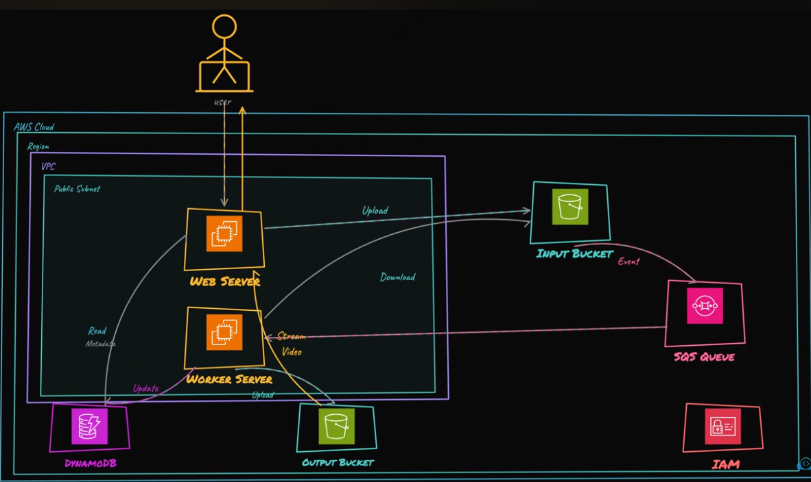

# Video Streaming App

This project deploys an event-driven media processing pipeline. A web EC2 instance accepts uploads, S3 emits object-created events, SQS buffers processing work, and a worker EC2 instance converts source videos into HLS output with FFmpeg.

## Architecture Diagram



## Architectural Approach

The architecture separates upload handling from video processing. The web tier accepts user uploads and records catalog state, while the worker tier processes videos independently after S3 events arrive through SQS. This avoids making users wait for transcoding during the upload request.

S3 is the system of record for media files, DynamoDB tracks video status, and SQS absorbs processing spikes or worker downtime. EC2 is used for the FFmpeg workload because media conversion is a longer-running compute task than a typical request/response function.

## Request/Data Flow

1. Users upload a video through the web app.
2. The web app stores the original object in the input bucket and records catalog state.
3. S3 sends an object-created event to SQS.
4. The worker consumes the queue, reads the input object, writes HLS output, and updates DynamoDB.
5. The web app lists processed videos and serves output from the private output bucket.

## Key AWS Services

- S3 stores original uploads and generated HLS output in private buckets.
- SQS and a dead-letter queue buffer video processing events from S3.
- EC2 runs the web application and FFmpeg worker with IAM instance profiles.
- DynamoDB stores the video catalog and processing status.

## Operational Considerations

- Queue-based processing makes uploads resilient to worker restarts and temporary processing backlogs.
- A production streaming system would usually add CloudFront, signed delivery, stronger upload validation, and a managed or autoscaled worker fleet.
- FFmpeg binaries and user-uploaded media should be treated as a supply-chain and security review point before production use.

## Remote State

The `backend/` folder bootstraps this project's Terraform state backend. It creates a private versioned S3 bucket for state, a DynamoDB table for state locking, and emits a `backend.hcl` file used by the main project. The bootstrap state stays local because the remote backend must exist before the main project can use it.

## Run

```bash
cp terraform.tfvars.example terraform.tfvars
terraform fmt -recursive

cd backend
terraform init
terraform apply
terraform output -raw backend_config > ../backend.hcl
cd ..

terraform init -backend-config=backend.hcl
terraform validate
terraform plan
terraform apply
```

Open the web app:

```bash
terraform output -raw web_url
```

## Tear Down

The buckets use `force_destroy = true` for lab cleanup, but for production you should empty and review buckets manually first.

```bash
terraform destroy
cd backend
terraform destroy
```

Destroy the main lab before destroying `backend/`. Only destroy the backend after confirming you no longer need the state history stored in S3.

## Best Practices

- Do not commit state, `.tfvars`, generated plans, `backend.hcl`, or uploaded media.
- Pin and verify third-party FFmpeg binaries before production use.
- Use CloudFront and a production HLS player for real streaming workloads.
- Keep EC2 access through SSM instead of public SSH.
- Destroy the lab when finished to avoid EC2, S3, and DynamoDB costs.
