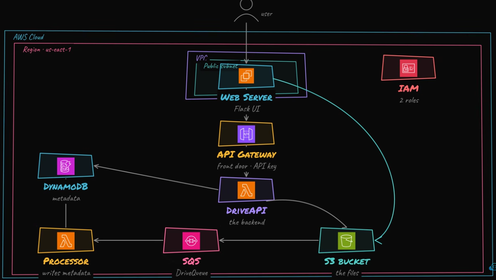

# File Storage App

This project deploys a secure file-storage lab with S3, DynamoDB metadata, SQS event processing, Lambda APIs, and an EC2-hosted UI proxy that keeps the API key server-side.

## Architecture Diagram



## Architecture

- `modules/storage` creates a private versioned S3 bucket and encrypted DynamoDB metadata table.
- `modules/queue` creates the S3 event queue, DLQ, queue policy, and S3 notification.
- `modules/lambda` creates the API and metadata Lambdas with separate least-privilege roles.
- `modules/api` creates REST API Gateway routes, API key, usage plan, throttling, and Lambda permission.
- `modules/ui` creates the EC2 UI server and public HTTP security group.

Data flow:

1. Browser requests go to the EC2 UI server.
2. The UI server calls API Gateway using the API key stored on the server.
3. The API Lambda returns presigned upload/download URLs and handles metadata operations.
4. S3 object-created events go to SQS.
5. The metadata Lambda consumes SQS and writes file metadata to DynamoDB.

## Remote State

The `backend/` folder bootstraps this project's Terraform state backend. It creates a private versioned S3 bucket for state, a DynamoDB table for state locking, and emits a `backend.hcl` file used by the main project. The bootstrap state stays local because the remote backend must exist before the main project can use it.

## Run

```bash
cp terraform.tfvars.example terraform.tfvars
terraform fmt -recursive

cd backend
terraform init
terraform apply
terraform output -raw backend_config > ../backend.hcl
cd ..

terraform init -backend-config=backend.hcl
terraform validate
terraform plan
terraform apply
```

Open the UI:

```bash
terraform output -raw ui_url
```

## Tear Down

The S3 bucket uses `force_destroy = true` for lab cleanup. Review contents before destroying if you used real files.

```bash
terraform destroy
cd backend
terraform destroy
```

Destroy the main lab before destroying `backend/`. Only destroy the backend after confirming you no longer need the state history stored in S3.

## Best Practices

- Do not embed API keys in browser JavaScript.
- Do not commit `terraform.tfvars`, local state, generated plans, `backend.hcl`, or API keys.
- Keep S3 public access blocked.
- Use remote state with locking outside solo lab work.
- Destroy the lab when finished to avoid EC2, API Gateway, S3, and DynamoDB costs.
