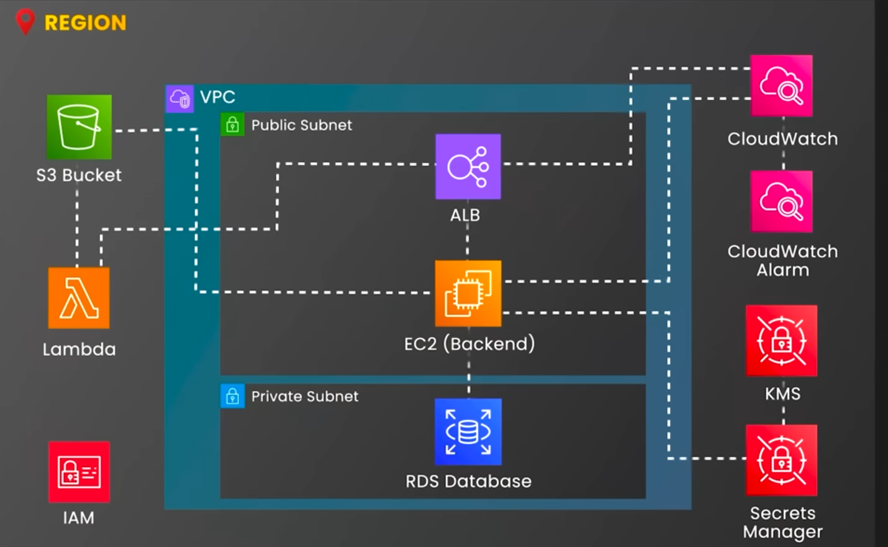

# Photo Sharing App

This project deploys a three-tier photo-sharing architecture with an event-driven metadata extension. An Application Load Balancer exposes the app tier, EC2 runs the Dockerized web application, RDS stores relational data in private subnets, S3 stores photo objects, and Lambda reacts to new uploads.

## Architecture Diagram



## Architectural Approach

The architecture follows a traditional web application pattern with clear network and data boundaries. Public subnets contain the load balancer, private subnets contain the database, and security groups restrict traffic from the ALB to the web tier and from the web tier to RDS.

The application separates binary photo storage from relational application data. S3 stores uploaded images, RDS stores structured records, Secrets Manager stores database credentials, and an S3-triggered Lambda provides an event-driven hook for photo metadata processing.

## Request/Data Flow

1. Users reach the ALB over HTTP.
2. The ALB forwards requests to the EC2 app instance.
3. The app reads database credentials from Secrets Manager and stores photos in S3.
4. RDS is private and accepts MySQL only from the web security group.
5. S3 object-created events invoke the metadata Lambda.

## Key AWS Services

- VPC, public subnets, private subnets, and route tables define the network layout.
- Application Load Balancer exposes the HTTP endpoint and forwards traffic to the EC2 app target.
- EC2 runs the Dockerized application with an IAM instance profile for AWS access.
- RDS MySQL stores relational data in private subnets, with credentials managed in Secrets Manager.
- S3 stores private encrypted photo objects, and Lambda handles upload-triggered metadata work.

## Operational Considerations

- The public entry point is limited to the ALB; the database remains private and security-group restricted.
- Separating S3 object storage from RDS avoids storing large binary data in the relational database.
- Production hardening should add HTTPS, multiple app instances, backups, deletion protection, final snapshots, container image review, and tighter secret rotation.

## Remote State

The `backend/` folder bootstraps this project's Terraform state backend. It creates a private versioned S3 bucket for state, a DynamoDB table for state locking, and emits a `backend.hcl` file used by the main project. The bootstrap state stays local because the remote backend must exist before the main project can use it.

## Run

```bash
cp terraform.tfvars.example terraform.tfvars
terraform fmt -recursive

cd backend
terraform init
terraform apply
terraform output -raw backend_config > ../backend.hcl
cd ..

terraform init -backend-config=backend.hcl
terraform validate
terraform plan
terraform apply
```

Open the app:

```bash
terraform output -raw application_url
```

## Tear Down

The RDS final snapshot is skipped for lab cleanup and the S3 bucket uses `force_destroy = true`. Do not use those settings for production data.

```bash
terraform destroy
cd backend
terraform destroy
```

Destroy the main lab before destroying `backend/`. Only destroy the backend after confirming you no longer need the state history stored in S3.

## Best Practices

- Do not commit `.tfvars`, local state, generated plans, `backend.hcl`, secrets, or database credentials.
- Use private subnets for databases and separate security groups for ALB, app, and DB.
- Enable final snapshots and deletion protection for production databases.
- Pin and review the container image before production use.
- Destroy the lab when finished to avoid ALB, EC2, RDS, and S3 costs.
